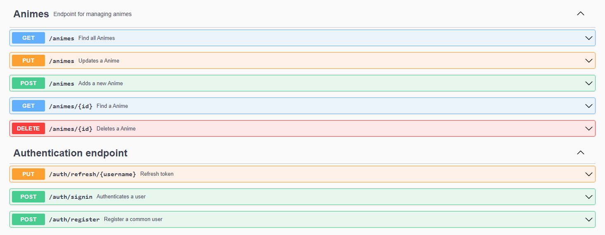

# 😆 Anime API (spring-security)
O spring-security é uma simples implementação de autenticação em uma API Restful de animes utilizando Spring
Security 6.0. A autenticação foi desenvolvida em dois formatos em que estão separadas por branchs diferentes: 
 * Banco de dados via JPA (main)
 * Token JWT (jwt-authentication)

Em geral, para o desenvolvimento deste projeto, abordou-se conceitos como:
* Controle de acesso por roles
* Desenvolvimento de filtros customizados
* Ciclo de vida do FilterChain
* Autenticação de usuário por banco de dados
* Autenticação de usuário por token JWT
* Cookie de autenticação (RememberMeToken)

#### Extras:
* Paginação
* HATEOAS
* Migrations
* DTOs
* Documentação com Swagger-UI

## 👨‍💻 Tecnologias
As tecnologias utilizadas para o desenvolvimento desse projeto foram:
* Java 17
* Spring Boot 3.0.6
* Spring Security 6.0.2
* Spring Data JPA
* Spring HATEOAS
* SpringDoc OpenAPI Starter WebMVC UI
* Flyway 
* Lombok
* H2 Database

## 🛠️ Como rodar
* Compile e rode a aplicação usando maven

```java 
mvn clean package
java -jar .\target\spring-security-0.0.1-SNAPSHOT.jar
```

* Como alternativa, você pode executar o aplicativo sem empacotá-lo usando

``` java
mvn spring-boot:run
```

O aplicativo começará a executar em ``localhost:8080``.

## 🧭 Rotas
Essas são as rotas da Anime API:



Você pode explorá-las acessando o link
localmente: ``http://localhost:8080/swagger-ui/index.html#/``
